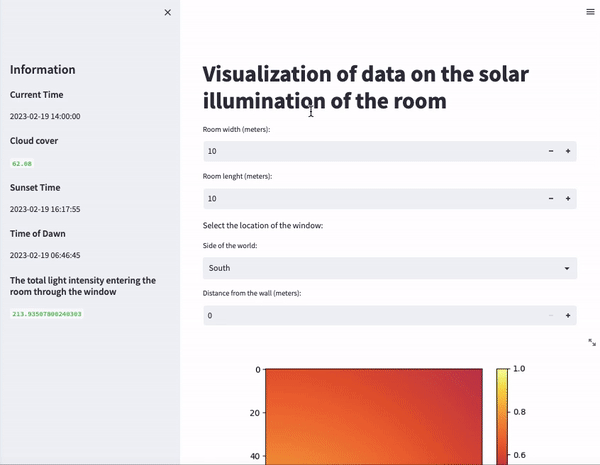

# Visualization of data on the solar illumination of the room  
This project calculates the illumination of a room based on the position of the sun, cloud cover, and the direction of windows. It visualizing the results using a heatmap with different zones representing levels of illumination.



The project generates a heatmap that shows the level of illumination in the room, with three different zones representing areas with different levels of brightness. The zones are:

Dark zone: Since this area receives the least amount of natural light, it is best used as a space for activities that do not require bright light, such as a home theater or a cozy reading nook. 

Medium-light zone: This area receives moderate amounts of natural light and is perfect for a workspace, an art studio, or a craft room, where natural light can help with color accuracy and reduce eye strain.

Light zone: The area that receives the most natural light is best suited for activities that require bright light, such as a dining area, a playroom, or a home gym.

## Installation
To use this project, you will need to install the required Python packages specified in the requirements.txt file. You can do this by running the following command:

```python
pip install -r requirements.txt
```

## API Integration
This project integrates two APIs endpoints from Storm Glass, a weather and marine data provider. The project uses the following endpoints:

https://api.stormglass.io/v2/weather/point: This endpoint provides weather data for a specific location, including cloud cover.

https://api.stormglass.io/v2/astronomy/point: This endpoint provides astronomical data for a specific location (time of sunset and time of dawn). *(The ephem library was used to determine the position of the sun)*

To use these APIs, you need to sign up for a free account on the Storm Glass website, and obtain an API key. Once you have the API key, create a new file called secret.py in the root of the project directory, and add the following line to it:

```python
API_KEY = 'your-api-key-goes-here'
```

Replace your-api-key-goes-here with the API key you obtained from the Storm Glass website. This file is imported in the retrieve_current_data_api.py file, so make sure it is in the root directory before running the application.

## Launch

```python
streamlit run <*the path to the directory where it is located main.py*>
```

## Contributing
Contributions to this project are welcome. If you notice a bug or have a feature request, please open an issue on the repository. If you would like to contribute code, please fork the repository and submit a pull request with your changes.
